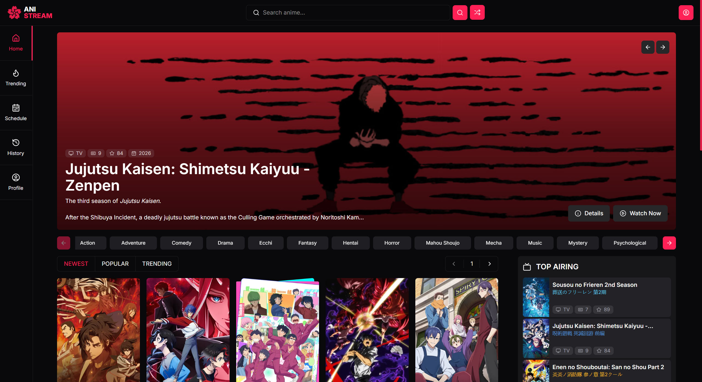

<div align="center">
  <p align="center"></p>
  <h1 style="border: none;">SnackWhiz: AI-Generated Snack Recipes</h1>
  <div>
    
    
    
    
    
  </div>
</div>

## 📋 <a name="table">Table of Contents</a>

1. 🤖 [Introduction](#introduction)
2. ⚙️ [Tech Stack](#tech-stack)
3. 🔋 [Features](#features)
4. 🤸 [Quick Start](#quick-start)

## <a name="introduction">🤖 Introduction</a>

**Anistream** is a modern anime streaming web application for discovering, browsing, and watching anime through a clean and responsive interface.

The platform provides features such as trending anime listings, seasonal filtering, anime detail pages, and episode streaming. The project focuses on creating a smooth user experience with fast navigation, organized content, and a minimalistic design optimized for both desktop and mobile devices.
<br /><br />


## <a name="tech-stack">⚙️ Tech Stack</a>

- Next.js 16
- React 19
- TypeScript
- Tailwind CSS
- Zustand
- Radix UI
- Embla Carousel
- HLS.js
- ArtPlayer

## <a name="features">🔋 Features</a>

👉 Anime Discovery

- Browse trending and newest anime.
- Explore seasonal anime by year and season.

👉 Anime Details

- View anime synopsis, metadata, and additional information.
- Organized layout for better readability.

👉 Episode Streaming

- Watch anime episodes using **HLS streaming**.
- Custom video player powered by **ArtPlayer** and **HLS.js**.

👉 Modern UI

- Clean and minimal interface.
- Fully responsive for desktop and mobile devices.

## <a name="quick-start">🤸 Quick Start</a>

Follow these steps to set up the project locally on your machine.

**Prerequisites**

Make sure you have the following installed on your machine:

- [Git](https://git-scm.com/)
- [Node.js](https://nodejs.org/en)
- [npm](https://www.npmjs.com/) (Node Package Manager)

**Cloning the Repository**

```bash
git clone https://github.com/Firkhie/anistream.git
cd anistream
```

**Package Installation**

Install the project dependencies using npm:

```bash
npm i
```

**Set Up Environment Variables**

Create a new file named `.env` in the root of your project and add the following content:

```env
NODE_ENV=
NEXT_PUBLIC_APP_HOST=
NEXT_PUBLIC_APP_URL=

NEXT_PUBLIC_ANISTREAM_API=
NEXT_PUBLIC_ANILIST_IDS_URL=
NEXT_PUBLIC_M3U8_PROXY=
```

Replace the placeholder values with your actual respective account credentials.

**Running the Project**

```bash
npm run dev
```

Open [http://localhost:3000](http://localhost:3000) in your browser to view the project.

#
